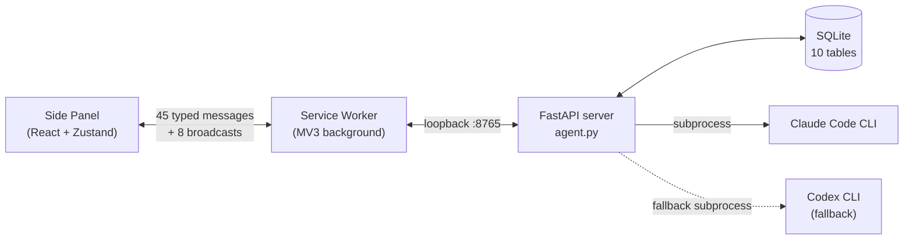

<div align="center">

# AI Tab Optimizer

**A local-first Chrome extension that turns 100+ tabs into structured, searchable knowledge — without sending your browsing data to anyone.**

[](https://github.com/eiler2005/ai-tab-optimizer/actions/workflows/ci.yml)
[](CHANGELOG.md)
[](https://developer.chrome.com/docs/extensions/mv3/)
[](https://www.google.com/chrome/)
[](extension/tsconfig.json)
[](https://python.org)
[](LICENSE)

</div>

---

## Why this exists

If you live with 100+ open tabs, two things are true at the same time: you can't find anything, and you can't bring yourself to close anything because *something might be useful later*. AI Tab Optimizer is the toolkit I wanted for that exact problem — it understands what's open, groups it by topic, gives you per-tab recommendations with reasons, lets you safely clean up through a guided session, and remembers everything in a local database so the work isn't lost when you close the tab.

It's deliberately **local-first**: a Chrome MV3 extension talks to a FastAPI server on `localhost`, which orchestrates AI CLIs (Claude Code, Codex) and persists everything in SQLite. Nothing leaves your machine unless an explicitly-configured CLI does so. There is no backend service, no telemetry, and no account.

This repo is also a deliberate engineering exercise. It's structured to be reviewable: typed end-to-end, modular, testable, with the trade-offs documented openly in [`docs/ARCHITECTURE.md`](docs/ARCHITECTURE.md).

## Demo

> Screenshots and a short walkthrough are coming. The capture conventions and the eight views to capture are documented in [`docs/screenshots/README.md`](docs/screenshots/README.md).

| View | What's there |
|---|---|
| **Tab List** | All open tabs across windows; filter, bulk close, duplicate badges |
| **AI Analysis** | Per-tab recommendations (keep / group / read later / archive / close) with confidence and reason |
| **Topic Clusters** | AI-grouped themes; one click creates a Chrome tab group |
| **Analytics** | Habits score, 7×24 activity heatmap, LLM-generated browsing insights |
| **Search** | Conversational search over tab history and analysis results |
| **Cleanup Session** | Guided step-by-step: review, accept/skip, close in bulk |
| **Snapshots** | Save and restore full browser sessions |
| **Settings** | AI provider, LLM call logs, URL cache browser, Obsidian vault path |

## Quick start

```bash
git clone https://github.com/eiler2005/ai-tab-optimizer.git
cd ai-tab-optimizer

cd extension && pnpm install && pnpm build && cd ..   # builds extension/dist/
python -m venv .venv && .venv/bin/pip install -r requirements.txt
pnpm server                                           # FastAPI on http://localhost:8765
```

Then open `chrome://extensions`, enable Developer mode, click **Load unpacked**, and select `extension/dist/`. Click the extension icon to open the side panel.

For the long version (CLI provider setup, troubleshooting, manual test flows for every view) see [SETUP.md](SETUP.md).

## How it works



Three patterns worth flagging up front, each documented in detail in [`docs/ARCHITECTURE.md`](docs/ARCHITECTURE.md):

- **Type-driven message protocol** — every message between the panel and the service worker is a member of a single discriminated union (45 request types, 8 broadcast events). Adding one without handling it doesn't compile.
- **Stop-and-resume long runs** — the `analysis_runs` table stores per-tab statuses, pending tabs, partial results, and accumulated metadata. A 1,200-tab analysis can be stopped, the extension can reload, and the user can resume from the same fingerprint.
- **Per-batch provider failover** — Claude Code → Codex CLI → heuristic, decided per batch by a small policy module ([`server_core/provider_policy.py`](server_core/provider_policy.py)). A transient rate limit on one batch doesn't kill the run.

## Tech stack

| Layer | Choice | Why |
|---|---|---|
| Extension UI | React 18 + Zustand + Tailwind | Side panel needs ~10 views with shared state; Zustand keeps the store under 800 lines |
| Extension build | Vite (4 entry points) + TypeScript `strict` | Fast HMR, tiny bundles, zero `any` in source |
| Background | MV3 service worker, modular | Split into `transport.ts`, `persistence.ts`, `analysis-helpers.ts`, `tab-actions.ts` |
| Server | FastAPI + uvicorn + aiosqlite | HTTP boundary, async I/O, easy to extend with new endpoints |
| Storage | SQLite (10 tables) | Cheap aggregation for analytics, queryable for the chat search; survives extension reload |
| AI providers | Claude Code CLI (primary), Codex CLI (fallback), heuristic | No API keys in code — the CLIs own their auth |
| Tests | Vitest (TS) + pytest (Python) | Co-located unit tests, integration tests with real SQLite + stubbed subprocess |
| Hooks | Husky pre-commit | TS typecheck on staged files + secret scan |
| CI | GitHub Actions | Typecheck, build, Python `py_compile` |

## Privacy and security

| Aspect | Behaviour |
|---|---|
| Where data lives | `tab_analysis.db` (local SQLite) and `chrome.storage.local`. Nothing in the cloud. |
| Network calls from the extension | Only to `http://localhost:8765`. Enforced by the manifest. |
| Network calls from the server | Only the AI CLIs' own outbound traffic (Claude Code is local; Codex CLI may relay prompts to OpenAI through its own auth). The user picks. |
| Permissions | Minimum necessary. `<all_urls>` is **optional** and granted only when the user triggers page extraction. |
| Authentication | The CLIs handle their own auth. The repo never reads or stores their credentials. |
| Telemetry | None. |
| Pre-commit secret scan | `.husky/pre-commit` blocks commits that look like they leak a key. |

The full threat model and the responsible-disclosure process are in [SECURITY.md](SECURITY.md).

## Project structure

```
ai-tab-optimizer/
├── agent.py                           # FastAPI server entrypoint
├── server_core/                       # Provider policy, runtime state, retention constants
├── tests/                             # pytest integration & behaviour tests
├── extension/
│   ├── src/
│   │   ├── background/                # MV3 service worker, split into modules
│   │   │   ├── service-worker.ts      #   listeners + message router
│   │   │   ├── transport.ts           #   HTTP layer with timeout + fallback
│   │   │   ├── persistence.ts         #   chrome.storage.local helpers
│   │   │   ├── analysis-helpers.ts    #   tab fingerprinting, status math
│   │   │   └── tab-actions.ts         #   typed Chrome tab API wrappers
│   │   ├── side-panel/                # React app: 8 views, Zustand store, components
│   │   ├── popup/                     # Minimal popup that opens the side panel
│   │   ├── content/page-extractor.ts  # On-demand meta/H1/excerpt extractor
│   │   └── shared/                    # Types (incl. message union), utils, i18n
│   └── public/manifest.json           # MV3 manifest
├── docs/
│   ├── ARCHITECTURE.md                # Architectural tour with Mermaid diagrams
│   ├── TESTING.md                     # Test strategy, runners, gaps
│   ├── IMPROVEMENTS.md                # Honest backlog of known limitations
│   ├── screenshots/                   # Capture conventions for README screenshots
│   └── testing/                       # TEST_PLAN.md and TEST_REPORT.md
├── PROJECT.md                         # Full product spec (every type, every endpoint)
├── SETUP.md                           # Detailed dev environment guide
├── OBSIDIAN_INTEGRATION.md            # Vault export entity spec
├── SECURITY.md                        # Threat model + disclosure policy
├── CONTRIBUTING.md                    # How to contribute
└── CHANGELOG.md                       # Versioned history (Keep-a-Changelog)
```

## Documentation map

| If you want to... | Read |
|---|---|
| Get the project running locally | [SETUP.md](SETUP.md) |
| Understand the architecture | [docs/ARCHITECTURE.md](docs/ARCHITECTURE.md) |
| See the full product spec, types, and endpoints | [PROJECT.md](PROJECT.md) |
| Know what's tested and how | [docs/TESTING.md](docs/TESTING.md) |
| See known limitations and proposed work | [docs/IMPROVEMENTS.md](docs/IMPROVEMENTS.md) |
| Report a security issue | [SECURITY.md](SECURITY.md) |
| Contribute | [CONTRIBUTING.md](CONTRIBUTING.md) |
| See what changed in each release | [CHANGELOG.md](CHANGELOG.md) |

## Roadmap

| Version | Status | Highlights |
|---|---|---|
| v0.1 | ✅ Shipped | Tab list, rule-based analysis, manual snapshots, Obsidian export |
| v0.2 | ✅ Shipped | AI analysis with batching, tab history, topic clusters, cleanup session, auto-snapshots |
| v0.2.1 | ✅ Shipped | Analytics, focus mode, resumable analysis, per-tab status, chat search |
| **v0.3** | Planned | Provider health UI, snapshot comparison, additional CLI adapters, expanded test coverage |
| v1.0 | Planned | Onboarding, keyboard shortcuts, Chrome Web Store release |
| v2.0 | Planned | Cross-device sync, Obsidian plugin, broader local-model support |

Detailed feature breakdown by version: [MVP_FEATURES.md](MVP_FEATURES.md). Honest list of what's missing today: [docs/IMPROVEMENTS.md](docs/IMPROVEMENTS.md).

## Contributing

Contributions are welcome — see [CONTRIBUTING.md](CONTRIBUTING.md) for the short version (TL;DR commands, code style, where to put things, what gates to pass). Be sure to read [CODE_OF_CONDUCT.md](CODE_OF_CONDUCT.md) and the threat model in [SECURITY.md](SECURITY.md) before contributing security-sensitive code.

## License

MIT — see [LICENSE](LICENSE).

---

<div align="center">

Built by <a href="https://github.com/eiler2005">Denis Ermilov</a> · React · FastAPI · SQLite · Claude Code · Codex CLI

</div>
