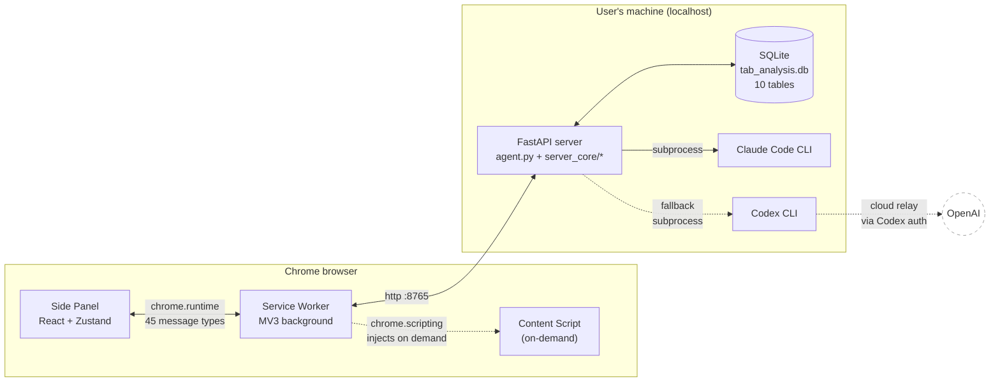
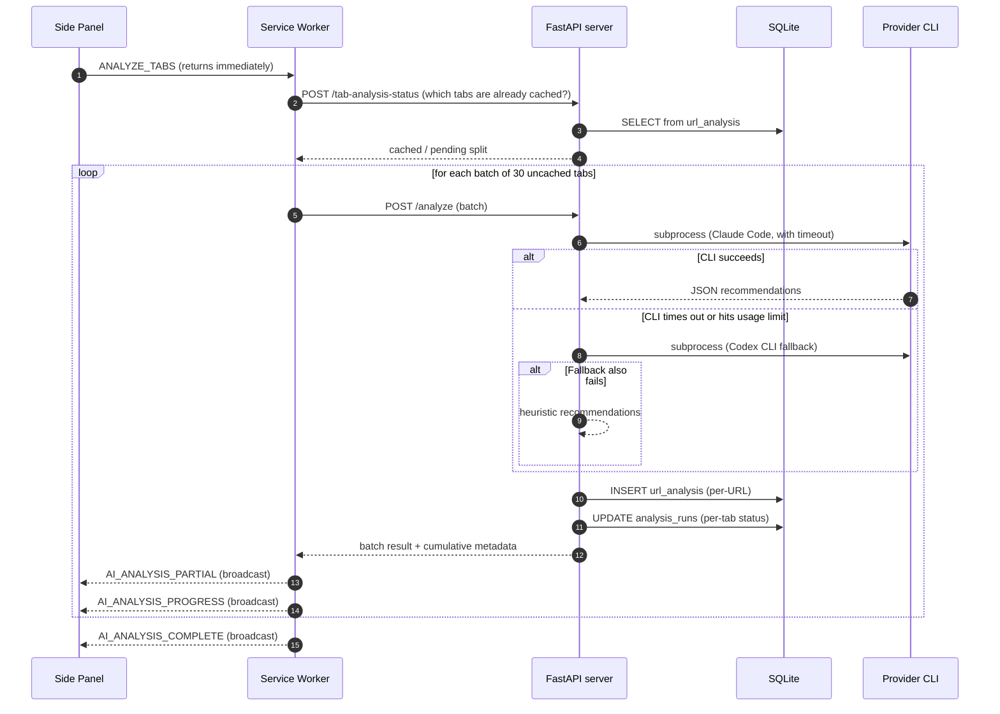
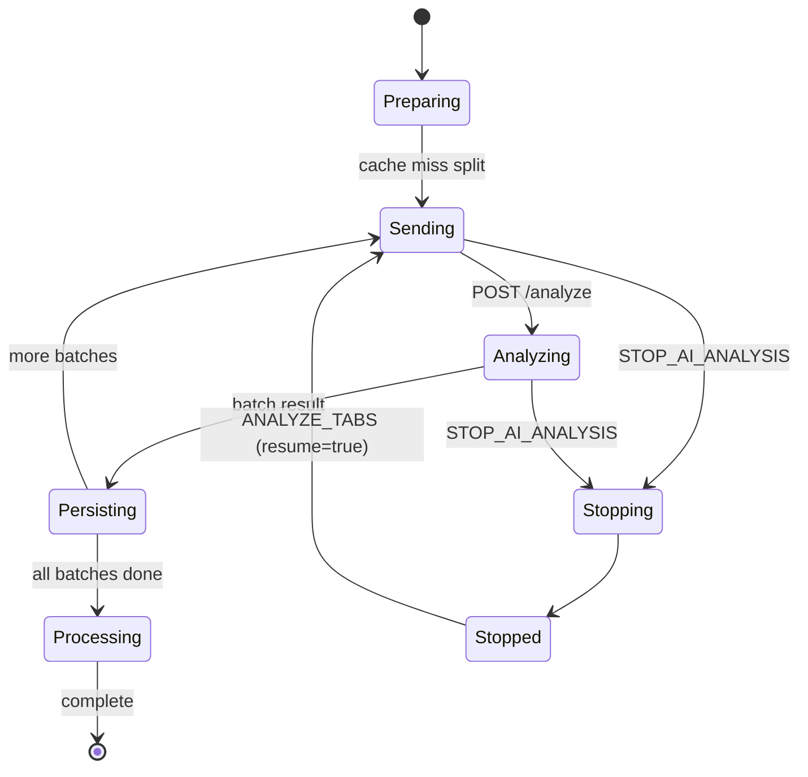
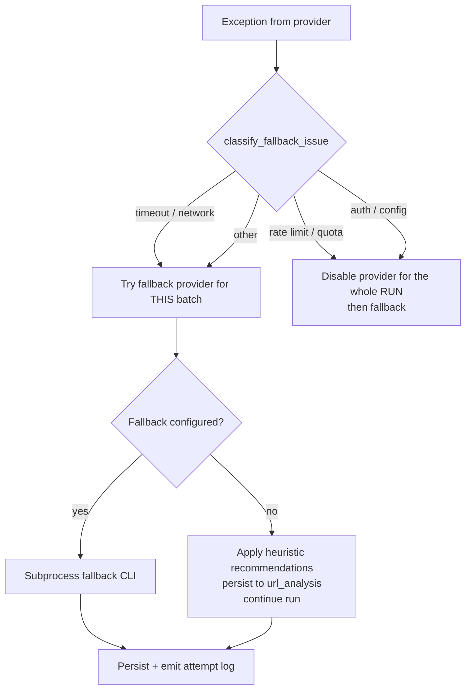

# Architecture

> A condensed architectural tour for someone who has never opened the codebase before. For the full product spec see [PROJECT.md](../PROJECT.md); for the dev environment see [SETUP.md](../SETUP.md).

## At a glance

AI Tab Optimizer is a Chrome MV3 extension paired with a localhost FastAPI server that orchestrates AI CLIs and persists everything in SQLite. The extension stays small and reactive; the heavy lifting (LLM calls, retention, analytics, search) lives in the server. They communicate over loopback HTTP through the service worker, so nothing leaves the user's machine unless an explicitly-configured CLI does so.



The dashed arrow is the only cloud-bound path, and only when the user has explicitly enabled the Codex fallback.

## Component map

| Component | Path | Responsibility |
|---|---|---|
| Side Panel | [`extension/src/side-panel/`](../extension/src/side-panel) | All UI: 8 views, Zustand store, broadcast event handlers |
| Service Worker | [`extension/src/background/service-worker.ts`](../extension/src/background/service-worker.ts) | Chrome API bridge, listeners, message router (45 request types), AI server proxy |
| Transport | [`extension/src/background/transport.ts`](../extension/src/background/transport.ts) | HTTP layer with timeouts, multi-candidate URL fallback, abort handling |
| Persistence | [`extension/src/background/persistence.ts`](../extension/src/background/persistence.ts) | `chrome.storage.local` wrappers |
| Analysis helpers | [`extension/src/background/analysis-helpers.ts`](../extension/src/background/analysis-helpers.ts) | Tab fingerprinting, status computation |
| Tab actions | [`extension/src/background/tab-actions.ts`](../extension/src/background/tab-actions.ts) | Typed Chrome tab API wrappers with `failedTabIds` tracking |
| Content script | [`extension/src/content/page-extractor.ts`](../extension/src/content/page-extractor.ts) | Pulls meta description / first H1 / 500-char excerpt; injected only when the user opts in |
| Shared types | [`extension/src/shared/types/`](../extension/src/shared/types) | TypeScript interfaces, including the message discriminated union |
| FastAPI server | [`agent.py`](../agent.py) | HTTP surface, batching, prompt assembly, SQLite I/O |
| Server core | [`server_core/`](../server_core) | Provider failover policy, runtime state machine, retention constants |

## Type-driven message protocol

Every message between the side panel and the service worker is a member of a single discriminated union in [`shared/types/messages.ts`](../extension/src/shared/types/messages.ts) (45 request types, 8 broadcast event types). Adding a new message means extending the union; the compiler then forces the message handler to cover it. This eliminates an entire class of routing bugs that are common in Chrome extensions.

```ts
// Sketch — see the actual file for the full union.
export type MessageRequest =
  | { type: 'GET_ALL_TABS' }
  | { type: 'ANALYZE_TABS'; resume?: boolean }
  | { type: 'STOP_AI_ANALYSIS' }
  | { type: 'CHAT_SEARCH'; query: string; history?: ChatTurn[] }
  // … 41 more variants
```

The same pattern is used for broadcasts (`AI_ANALYSIS_PROGRESS`, `AI_ANALYSIS_PARTIAL`, `HISTORY_UPDATED`, …) so the side-panel listener is exhaustive against the union.

## Data model — SQLite schema

The server keeps everything in a single SQLite database (`tab_analysis.db`), 10 tables, normalized:

| Table | Purpose | Why it exists separately |
|---|---|---|
| `url_analysis` | Per-URL AI cache with 180-day TTL | Avoids re-analyzing the same tab; keyed by `(url, provider, model)` so settings changes correctly bust the cache |
| `analysis_sessions` | Run metadata (cost, tokens, duration) | Per-run audit, surfaces in Settings |
| `analysis_runs` | Full snapshot of a run's state | Enables stop-and-resume across extension reloads |
| `tab_history_events` | Append-only event stream (`opened`/`closed`/`activated`) | Backbone of the History panel and the activity heatmap |
| `snapshots` | Saved browser sessions | Survive extension reload/uninstall |
| `app_settings` | Server-side authoritative settings | Single source of truth across reloads |
| `runtime_logs` | Provider/analysis/database diagnostic stream | Server-side observability without a full logging stack |
| `llm_call_logs` | Individual LLM call records | Cost/latency forensics per call |
| `recommendation_actions` | Accepted / skipped / modified cleanup actions | Feeds the acceptance-rate analytics |
| `topic_clusters` | Persistent AI topic clusters | Survive across analyses, power Focus Mode |

## Analyze flow — fire-and-forget batching

The hardest constraint in this product is "must work with 1000+ open tabs without hitting Chrome's message-channel timeout." The solution is fire-and-forget batching: `ANALYZE_TABS` returns immediately; progress and results come back as broadcasts.



Notice three things worth pointing out in a code review:

1. The cache check happens **before** any CLI invocation, so re-running an analysis on a stable tab set is effectively free.
2. The fallback chain (Claude Code → Codex CLI → heuristic) is decided per-batch, not per-run, so a transient rate limit on one batch doesn't kill the whole analysis.
3. Per-batch results are persisted to SQLite **before** the broadcast, so a service-worker restart mid-broadcast doesn't lose data.

## Stop-and-resume

`analysis_runs` stores the full state of a long-running analysis: pending tab IDs, per-tab statuses, partial result, accumulated metadata. A run can be stopped explicitly, killed by a service-worker restart, or terminated when the CLI is force-quit — and the user can resume it later, picking up from the same fingerprint.



The `resume?: boolean` flag on `ANALYZE_TABS` is the only knob that distinguishes a fresh run from a continuation — the server reads the latest `analysis_runs` row and resumes from its pending list.

## Provider failover policy

Failover is **not** an inline `try/except`. It's a small policy module ([`server_core/provider_policy.py`](../server_core/provider_policy.py)) that classifies an exception and tells the analyze loop what to do:



Every attempt — success or failure — is recorded as a `ProviderAttempt`, surfaced in the runtime status card in the AI panel, and persisted to `runtime_logs`. The server never silently gives up.

## Resilience layer in the extension

The transport module ([`transport.ts`](../extension/src/background/transport.ts)) wraps every HTTP call with:

- a configurable timeout (`AbortController`);
- multiple endpoint candidates (HTTP/HTTPS, IPv4/IPv6 loopback) tried in order;
- explicit handling of abort errors so the side panel can distinguish "user stopped" from "request failed".

Combined with the server's per-batch persistence, this means the only way to lose work is for the user to close Chrome mid-batch — and even that only loses the in-flight batch, not the run.

## Permission model

The extension takes the smallest set of permissions that supports the feature scope:

| Permission | Required by | Notes |
|---|---|---|
| `tabs`, `tabGroups`, `sessions` | Tab list, history, recently closed | Read-only for tab metadata |
| `storage` | Settings, offline buffers, user flags | `chrome.storage.local` only |
| `alarms` | Auto-snapshot, history cleanup sweeps | |
| `sidePanel` | Primary UI surface | Chrome 114+ |
| `scripting` | Optional content script injection | Only fires when the user requests page extraction |
| `host_permissions: http://localhost/*` | Talk to the FastAPI server | Loopback only; `127.0.0.1` and `[::1]` also covered |
| `optional_host_permissions: <all_urls>` | Page extraction | **Optional** — granted only when the user opts in |

`<all_urls>` is intentionally optional, not default. See [SECURITY.md](../SECURITY.md) for the full threat model.

## Build and runtime topology

```
pnpm build  →  vite (4 entry points)  →  extension/dist/
                                           ├── service-worker.js
                                           ├── src/side-panel/index.html
                                           ├── src/popup/index.html
                                           └── content/page-extractor.js

pnpm server →  uvicorn agent:app on :8765  →  spawns CLI subprocesses on demand
```

The extension and the server have no compile-time coupling — only the JSON contracts in `messages.ts` and the FastAPI route signatures. That means you can iterate on the Python side without rebuilding the extension, and vice versa.

## Trade-offs and "why this, not that"

A few decisions that came up repeatedly during reviews and are worth stating explicitly:

- **Why a localhost FastAPI server instead of bundling the CLI calls into a Native Messaging host?** Faster iteration, easier to add HTTP endpoints, and lets the Python side own the SQLite schema. Cost: the user has to run `pnpm server`. Acceptable for a developer-facing tool.
- **Why SQLite instead of `chrome.storage.local` for everything?** `chrome.storage.local` has a 10MB default quota and isn't queryable. Tab history alone exceeds that quickly. SQLite gives us cheap aggregation for analytics and full-text-ish search for the chat dialog.
- **Why batches of 30, not one big request?** CLI providers have variable latency and partial-result tolerance. 30 keeps each round-trip under a few seconds, lets the UI show progress, and matches the typical "one screen worth of tabs" mental model.
- **Why Zustand and not Redux/Jotai?** The store has 9 slices; Redux's boilerplate would dominate the file, and Jotai's atomic model fights the broadcast-event pattern. Zustand stays under 800 lines for the whole app.
- **Why a single 2,389-line service worker file?** It started small and grew. The incoming-message switch is sequential by nature; splitting it into N handler files would replace one file you can grep with N files you have to chase. Modularization is on the [improvements backlog](IMPROVEMENTS.md).

## Where to go next

- [PROJECT.md](../PROJECT.md) — full product spec, every type, every endpoint
- [docs/TESTING.md](TESTING.md) — what's tested, with which tools, and where the gaps are
- [SECURITY.md](../SECURITY.md) — threat model and disclosure policy
- [docs/IMPROVEMENTS.md](IMPROVEMENTS.md) — known limitations and proposed work
